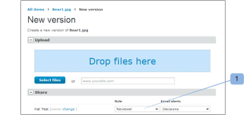

# Gerenciar funções de prova no [!DNL Workfront Proof]

<!-- Audited: 01/2024 -->

>[!IMPORTANT]
>
>Este artigo se refere à funcionalidade no produto independente [!DNL Workfront Proof]. Para obter informações sobre prova dentro do [!DNL Adobe Workfront], consulte [Prova](../../../review-and-approve-work/proofing/proofing.md).

Funções de prova permitem que você conceda permissões a usuários limitados pelo perfil de permissão configurado em seus perfis de usuário. (Para obter mais informações sobre perfis de permissão, consulte [Perfis de permissões de prova em [!DNL Workfront Proof]](../../../workfront-proof/wp-acct-admin/account-settings/proof-perm-profiles-in-wp.md).)

As funções de prova são diferentes dos perfis de conta. O perfil da conta está relacionado ao nível geral de permissão que você tem na conta e afetará os direitos que você tem sobre todas as provas na conta, mesmo aquelas que não foram compartilhadas explicitamente com você.

Para obter mais informações, consulte [Perfis de permissões de prova em [!DNL Workfront Proof]](../../../workfront-proof/wp-acct-admin/account-settings/proof-perm-profiles-in-wp.md).

## Sobre funções de prova

As seguintes funções de prova são concedidas aos usuários para uma prova individual no momento em que o usuário é convidado a revisar a prova:

* [Somente leitura](#read-only)
* [Revisor](#reviewer)
* [Aprovador](#approver)
* [Revisor e Aprovador](#reviewer-approver)
* [Autor](#author)
* [Moderador](#moderator)

A função de prova define quais ações um revisor pode realizar em relação a essa prova específica.

Por exemplo, se você for um Revisor, será solicitado que revise a prova adicionando marcações e comentários. Se você for um Revisor e Aprovador, será solicitado que revise e também tome uma decisão sobre a prova.

Certas funções de prova fornecem direitos de edição de revisor na prova (mesmo se o perfil da conta não tiver) e permitem que eles usem alguns recursos adicionais, como adicionar ações em comentários, criar novas versões e adicionar mais revisores à prova.

Para obter mais informações, consulte os seguintes artigos:

* [Usar ações em comentários de prova](../../../review-and-approve-work/proofing/reviewing-proofs-within-workfront/comment-on-a-proof/use-actions-on-comments-in-viewer.md)
* [Compartilhar uma prova no [!DNL Workfront Proof]](../../../workfront-proof/wp-work-proofsfiles/share-proofs-and-files/share-proof.md)

### Somente leitura

{#read-only}

 Pode exibir uma prova

 Não é possível adicionar marcações

 Não é possível adicionar comentários

 Não é possível tomar uma decisão

 Não é possível excluir comentários feitos por outros

 Não tem direitos de edição na prova

>[!NOTE]
>
>Se uma pasta for compartilhada com um usuário de [!DNL Workfront Proof], eles receberão automaticamente os direitos de Somente leitura para todos os itens existentes e adicionados posteriormente na pasta.

Para obter mais informações, consulte [Compartilhar pastas em [!DNL Workfront Proof]](../../../workfront-proof/wp-work-proofsfiles/organize-your-work/share-folders.md).

### Revisor {#reviewer}

 Pode exibir uma prova

 Pode adicionar marcações

 Pode adicionar comentários

![[!DNL cleaner].png](assets/cleaner.png) Pode editar seus próprios comentários se não houver respostas

 Não é possível tomar uma decisão

 Não é possível editar ou excluir comentários feitos por outros

 Não tem direitos de edição na prova

### Aprovador {#approver}

 Pode exibir uma prova

 Pode tomar uma decisão

 Não é possível adicionar marcações

 Não é possível adicionar comentários

 Não é possível editar ou excluir comentários feitos por outros

 Não tem direitos de edição na prova

### Revisor e Aprovador {#reviewer-approver}

 Pode exibir uma prova

 Pode adicionar marcações

 Pode adicionar comentários

![[!DNL cleaner].png](assets/cleaner.png) Pode editar seus próprios comentários se não houver respostas

 Pode tomar uma decisão

 Não é possível editar ou excluir comentários feitos por outros

 Não tem direitos de edição na prova

### Autor {#author}

 Pode adicionar marcações

 Pode adicionar comentários

![[!DNL cleaner].png](assets/cleaner.png) Pode editar seus próprios comentários se não houver respostas

 Pode tomar uma decisão

 Pode enviar novas versões

 Pode criar uma cópia da prova

 Pode compartilhar a prova com outras pessoas

 Pode aplicar ações em comentários

 Pode resolver comentários

 Não é possível editar ou excluir comentários feitos por outros

>[!NOTE]
>
>Esta função só pode ser atribuída a usuários de [!DNL Workfront Proof].

### Moderador {#moderator}

 Pode adicionar marcações

 Pode adicionar comentários

![[!DNL cleaner].png](assets/cleaner.png) Pode editar seus próprios comentários se não houver respostas

 Pode tomar uma decisão

 Pode enviar novas versões

 Pode adicionar novos revisores

 Pode aplicar ações em comentários

 Pode resolver comentários

 É possível excluir comentários e respostas na prova (feitos por eles mesmos ou por outras pessoas)

* A exclusão do primeiro comentário em uma thread de comentários excluirá a thread inteira
* A exclusão de respostas na thread de comentários excluirá somente essa resposta

 Não é possível editar comentários feitos por outros

Essa função permite que a pessoa gerencie e modere os comentários de prova, dando a ela a oportunidade de manter somente comentários relevantes sobre a prova e remover comentários não relevantes.

>[!NOTE]
>
>Esta função só pode ser atribuída a usuários de [!DNL Workfront Proof].

## Atribuição de funções de prova

Você pode atribuir funções de prova ao criar novas provas, criar novas versões de provas existentes ou em provas existentes.

### Novas provas {#new-proofs}

Funções de prova podem ser atribuídas a revisores no [!UICONTROL Nova prova] durante o processo de criação da prova (1).

### Novas versões {#new-versions}

Ao criar uma nova versão de uma prova, os revisores da versão anterior serão exibidos automaticamente (com a mesma função da versão anterior).

É possível editar as funções de prova aplicadas aos revisores ao criar a nova versão (1).

### Provas existentes {#existing-proofs}

Se quiser alterar a função de uma pessoa em uma prova existente, faça isso no [!UICONTROL Detalhes da prova] editando sua função em linha na seção workflow (1).

## Verificação de funções no Visualizador de prova

Você pode verificar a função de um revisor diretamente do Visualizador de prova (1) e editá-lo (2) se necessário.

## Funções de prova padrão

Você pode definir sua função de prova padrão no [!DNL Proofing Defaults] em suas Configurações pessoais. Isso significa que quando você é adicionado a uma prova, sua função de prova padrão será preenchida automaticamente. Observe que essa função pode ser alterada no nível da prova por um usuário com direitos de edição em uma prova.

>[!NOTE]
>
>Somente usuários com perfis de Administrador ou de Administrador de faturamento podem alterar os padrões de prova para outros usuários em suas contas.

Para obter mais informações, consulte [Configurações pessoais no [!DNL Workfront Proof]](../../../workfront-proof/wp-getstarted/personal-settings/personal-settings.md).

## Criadores e Proprietários

Criadores e proprietários têm direitos de edição completos sobre a prova.

### Criadores {#creators}

O criador da prova é a pessoa que faz o upload da prova na primeira instância. O criador da prova será mostrado automaticamente na lista de pessoas para a prova (em sua função padrão).

No [!UICONTROL Nova prova] página, é possível atribuir uma função de prova diferente ao criador da prova (diferente da função padrão).

O criador da prova não pode ser alterado ou removido de uma prova.

### Proprietários {#owners}

Por padrão, o Criador também é o Proprietário da prova; no entanto, o Criador pode tornar outra pessoa o Proprietário da prova ao criar inicialmente a prova (na guia [!UICONTROL Nova prova] página).

Para alterar o proprietário na página Nova prova:

1. Clique no link de alteração exibido ao lado do nome do Criador.
1. Selecione o novo Proprietário no menu suspenso. (2)

Depois que a prova for criada, ainda será possível alterar o proprietário. Qualquer pessoa com direitos de edição na prova poderá alterar a propriedade da prova para outro usuário por meio da [!UICONTROL Detalhes da prova] (veja abaixo).

A capacidade de alterar o Proprietário de uma prova é particularmente útil do ponto de vista do gerenciamento de workflow. Ele permite que a pessoa responsável pelo projeto assuma a propriedade das provas, dando a ela direitos de edição sobre as provas e a capacidade de visualizá-las na [!UICONTROL Minhas provas] exibição.

Para alterar o Proprietário da prova por meio da [!UICONTROL Detalhes da prova] página:

* Clique no menu Ações ao lado do nome da pessoa que você quer que seja o Proprietário.
* Selecionar [!UICONTROL **Tornar proprietário**] no menu suspenso.
* Como alternativa, você pode clicar na guia [!UICONTROL **Proprietário**] ao lado da imagem de prova e escolha o novo Proprietário no menu suspenso exibido.

Assim que isso for feito, a palavra &quot;Proprietário&quot; será exibida ao lado do nome dessa pessoa.

>[!NOTE]
>
>Somente um usuário da mesma conta ou uma conta de parceiro pode se tornar o proprietário de uma prova. Um usuário em uma conta de parceiro pode se tornar o proprietário de uma prova somente quando:
>
>* Já existe uma relação de parceiro configurada entre as contas. Para obter mais informações, consulte [Contas de parceiros em [!DNL Workfront Proof]](../../../workfront-proof/wp-acct-admin/partner-accounts/partner-accounts.md).
>* Não há campos personalizados no [!UICONTROL Nova prova] página.
>* A prova não foi atribuída a uma pasta.
>* Nenhuma tag foi aplicada à prova.

Para delegar temporariamente a propriedade da prova no [!DNL Workfront Proof], consulte [Designação de Proprietários Temporários de Prova no [!DNL Workfront Proof]](../../../workfront-proof/wp-getstarted/personal-settings/designate-temp-proof-owners.md).
